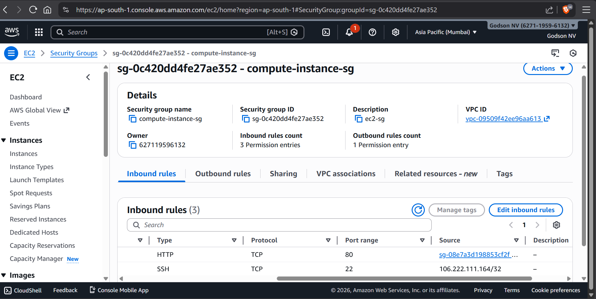
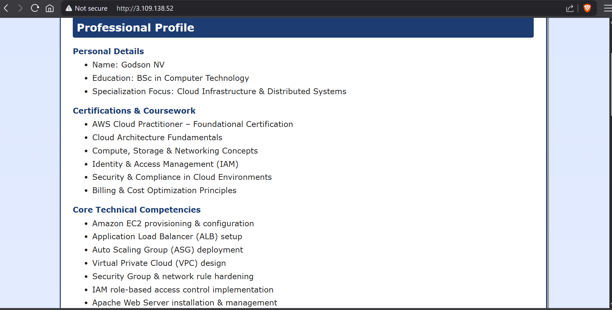
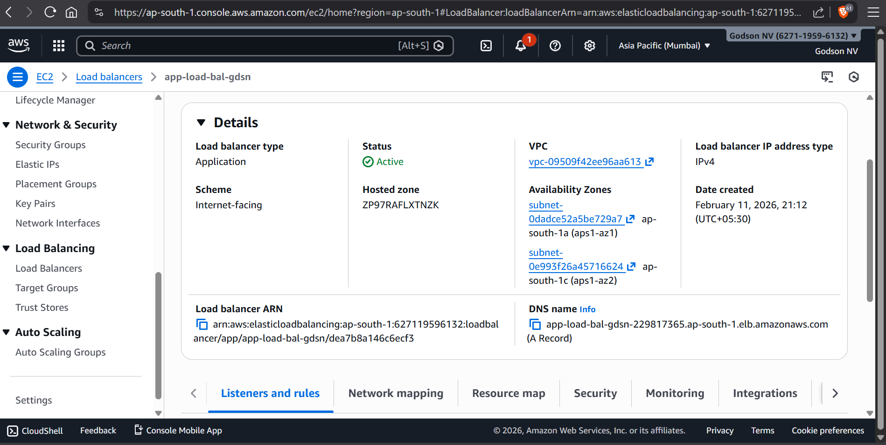
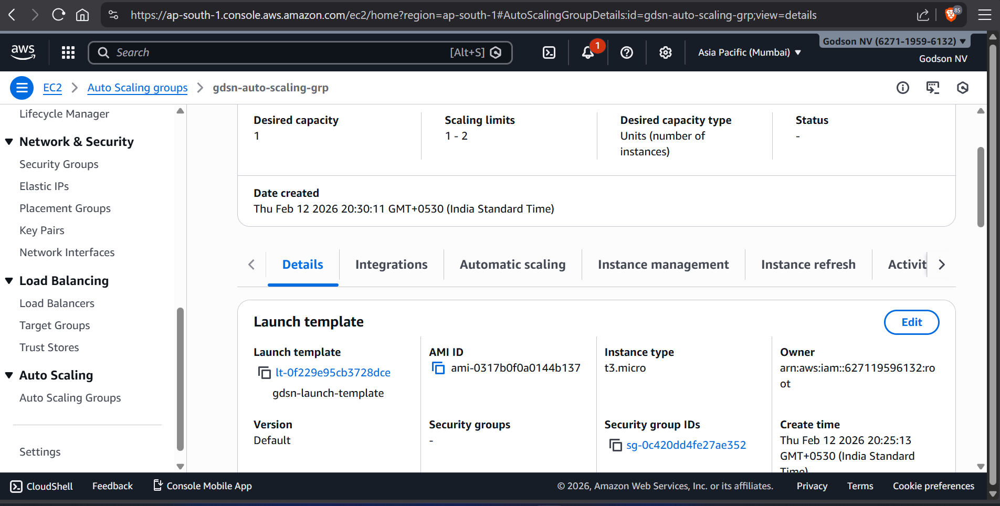
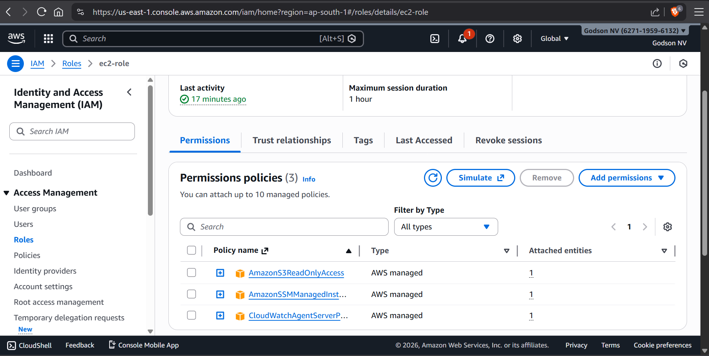
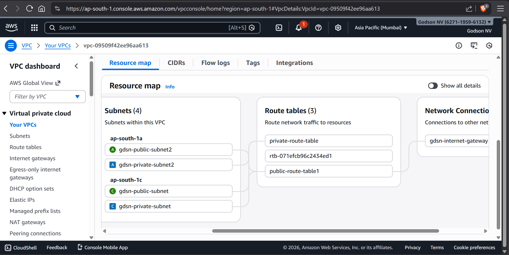

# AWS Cloud Infrastructure Project

## 👤 Professional Profile
- **Name:** Godson NV  
- **Education:** BSc in Computer Technology  
- **Certification:** AWS Cloud Practitioner  
- **Focus:** Cloud Infrastructure, Linux Administration, High Availability, Scalable Systems  

---

## 🌐 Project Overview
This project demonstrates hands-on deployment of a **scalable web application** on AWS, following professional cloud engineering practices. The website is hosted on **EC2** with **Apache**, behind an **Application Load Balancer (ALB)**, and configured with an **Auto Scaling Group (ASG)** for high availability. The infrastructure emphasizes security, scalability, and production-readiness.  

---

## 🛠 Services & Tools Used
- **Compute:** Amazon EC2 (Ubuntu)  
- **Load Balancing:** Application Load Balancer (ALB)  
- **Scaling:** Auto Scaling Group (ASG)  
- **Networking:** Virtual Private Cloud (VPC), Public Subnets  
- **Security:** Security Groups, IAM Roles, SSH Access  
- **Web Server:** Apache HTTP Server  
- **Administration:** Linux, WSL, Git  

---

## ⚙️ Implementation Details

### 1. Compute & Scaling
- Provisioned EC2 instances (Ubuntu) for web hosting  
- Configured Auto Scaling Group with dynamic policies  
- Defined min, desired, and max instances  
- Implemented automatic replacement of unhealthy instances  
- Horizontal scaling for fault tolerance  

### 2. Load Balancing
- Configured Application Load Balancer (Layer 7)  
- Created target groups and health checks  
- Distributed traffic across multiple EC2 instances  
- Ensured high availability of web service  

### 3. Networking Architecture
- Designed custom VPC  
- Configured public subnets and route tables  
- Attached Internet Gateway for external access  
- Implemented controlled inbound rules (HTTP, SSH)  
- Applied least-privilege network exposure  

### 4. Linux & Deployment Operations
- Installed Apache HTTP Server and managed with `systemctl`  
- Deployed website files to `/var/www/html`  
- Managed file permissions (`chmod`, `chown`)  
- SSH remote access setup  
- WSL-based administration and Git version control  

### 5. Security & IAM
- Configured IAM roles with principle of least privilege  
- Hardened Linux server access  
- Managed Security Groups for controlled traffic  
- Monitored server logs for troubleshooting  

---

## 📈 Future Enhancements
- Amazon RDS Multi-AZ deployment  
- Private subnet database isolation  
- Secure backend connectivity  
- Infrastructure as Code using Terraform  
- Monitoring & logging integration via CloudWatch  

---

## 🖼 Screenshots 

  
  
  

  


---

## 💡 Skills Demonstrated
- High Availability & Scalability  
- Cloud Security & IAM  
- Linux Server Management  
- DevOps Workflow & Git Integration  
- AWS Infrastructure Design & Deployment  

---

## 📌 How to Run Locally
1. Clone the repository:  
```bash
git clone https://github.com/godsonreigns19/AWS-Cloud-Project.git
